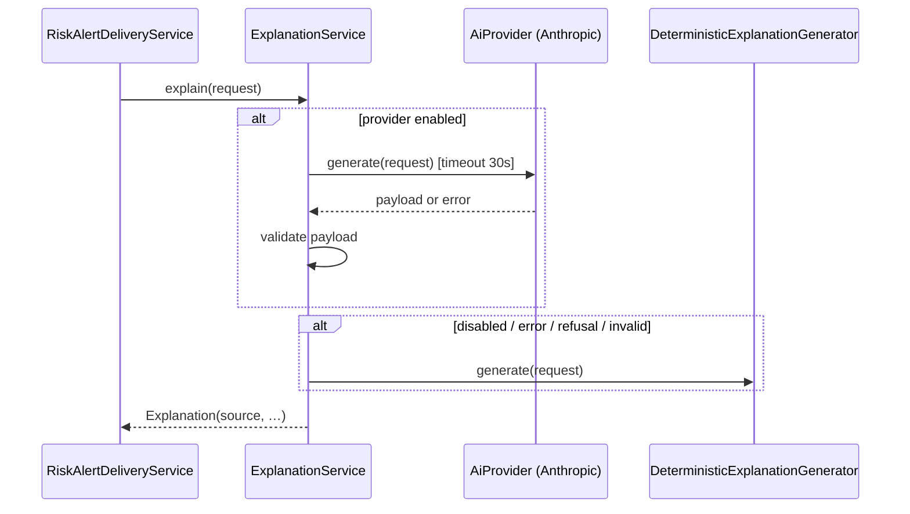

# AI Risk Engine

The engine has two strictly separated layers:

1. **Deterministic risk analysis** (`risk.engine`, pure Java) – detects, scores and explains risks from structured data. Fully unit-tested, no AI involved.
2. **Explanation & recommendation** (`recommendation`) – turns one assessment's evidence into wording and prioritized actions, using an LLM when configured, otherwise (or on failure) a deterministic generator.

## 1. Inputs (`ProjectSnapshot`)

Built in one `REPEATABLE READ` read-only transaction:

- Project: id, name, status, start date, deadline, `dataVersion`.
- Non-archived tasks: id, title, status, priority, assignee, start/due dates, estimated hours, progress, `createdAt`, `lastProgressAt`, `progressReported` (any `PROGRESS_UPDATED` activity exists).
- Finish-to-start edges between non-archived tasks.
- Project members (user id, display name, effective role).
- `today` (business-zone date from the injected `Clock`) and `now`.

Assumptions (configurable in `app.risk.*`): `hoursPerDay = 6`, weekends excluded from capacity, unknown task duration = 1 working day.

## 2. Rules

OVERDUE and APPROACHING signals also record, as a FACT, the contributing teammate (other than the assignee) with the fewest unfinished tasks, so recommendations can name a concrete reviewer or helper.

Each rule implements `RiskRule { List<RiskSignal> evaluate(AnalysisContext ctx); }`. A `RiskSignal` contains: category, subject (task/project/user), title, factors (code, description, points), evidence (`FACT` | `INFERENCE`, statement, data), affected task IDs, missing-data notes, confidence.

Common definitions: *open* = status not in {DONE, CANCELLED}; *downstream(t)* = transitive dependents of t that are open; *idleDays(t)* = whole days since `lastProgressAt` (or `createdAt` when no progress was ever recorded); *stalled factor* (used inside OVERDUE/APPROACHING) = `idleDays ≥ urgentStallDays` (default 2); the standalone STALLED rule uses `stallDays` (default 5).

Per-task precedence to avoid double counting: **OVERDUE > APPROACHING_DEADLINE > STALLED**. The stall signal is folded into overdue/approaching as a factor rather than emitted separately. BLOCKED_DEPENDENCY looks at the dependent task's perspective (a different concern) and PROJECT_DEADLINE/WORKLOAD aggregate with caps, not sums of task scores.

| Rule | Fires when | Factors (points) |
|---|---|---|
| `OVERDUE_TASK` | open task, `dueDate < today` | base 35; days late `min(25, 5·d)`; priority (CRITICAL 15, HIGH 10, MEDIUM 5); downstream `min(20, 5·n)`; stalled +10; progress ≥ 80 % −10 |
| `APPROACHING_DEADLINE` | open task, `0 ≤ daysUntilDue ≤ approachingDays` (3) and progress < 90 %, and at least one *pressure* factor | base 15; due today/1/2/3 days: 20/15/10/5; progress < 25 % 15, < 50 % 10, < 75 % 5 (only when progress reported, else "progress not reported" 5 with lower confidence); remaining estimate > available working hours +15; not started (TODO) +10; BLOCKED +10; stalled +10; priority (CRITICAL 10, HIGH 7, MEDIUM 3); downstream `min(15, 5·n)` |
| `STALLED_TASK` | started task (IN_PROGRESS/IN_REVIEW/BLOCKED), not overdue, not approaching, no progress for ≥ `stallDays` (5) | base 20; extra idle days `min(20, 2·(d − stallDays))`; due within 7 days +10; priority (CRITICAL 10, HIGH 7, MEDIUM 3); downstream `min(15, 5·n)` |
| `BLOCKED_DEPENDENCY` | open task T with ≥ 1 open prerequisite P that threatens T: P overdue (+25), P due after T's due date (+20), P blocked (+10), P unassigned (+5); plus T's start date reached while blocked (+15) | base 15; T due within 7 days +10; T priority (CRITICAL 10, HIGH 7, MEDIUM 3); downstream of T `min(15, 5·n)`. Only fires if at least one threat factor exists – merely waiting on an on-schedule prerequisite is normal. |
| `PROJECT_DEADLINE` | ACTIVE project with deadline and open tasks, and (deadline passed, or projected finish > deadline, or open tasks due after the deadline, or overdue cluster) | deadline passed +45; projected slip `min(40, 10 + 5·daysLate)`; tasks due after deadline `min(15, 5·n)`; overdue tasks `min(20, 5·n)`; ≥ 3 open HIGH/CRITICAL tasks within 7 days of deadline +10 |
| `WORKLOAD_IMBALANCE` | member with **≥ 2** open tasks due within `workloadHorizonDays` (10) whose remaining estimated hours exceed available hours by ratio > 1.2 at any due-date checkpoint (one task's shortfall is the deadline rules' `CAPACITY_SHORTFALL` and is not double counted); or (mostly unestimated) ≥ 6 open tasks due within the horizon | base 20; overload `min(35, round((ratio−1)·50))`; overdue assigned tasks `min(15, 5·n)`; count fallback 10. Confidence ≤ MEDIUM (calendars unknown) and LOW when > 50 % of tasks lack estimates. Evidence names teammates with the lowest load as possible helpers. |

### Projected finish (PROJECT_DEADLINE)

Forward pass in topological order (reused from the original `Scheduler`): each open task starts at `max(today, startDate, finish of prerequisites, assignee free-from)`, lasts `ceil(remainingHours / hoursPerDay)` working days (remaining = estimate × (1 − progress)), or 1 day when unknown. Projected finish = latest finish. The critical chain (tasks whose finish determines the projected finish) is reported as affected tasks.

## 3. Scoring and severity

`score = clamp(Σ factor points, 0, 100)`. Severity: `0–24 LOW`, `25–49 MEDIUM`, `50–74 HIGH`, `75–100 CRITICAL`. Signals below `minScore` (20) are discarded. All weights live in `ScoringPolicy` / `RiskProperties` (thresholds) and are covered by unit tests.

**Scores are heuristics, not probabilities.** The API never calls a score a likelihood; explanations state "heuristic score 68/100". No numeric likelihood is produced because no calibration data exists.

## 4. Confidence & missing data

Each rule lists missing inputs (no estimate, progress never reported, no due date on prerequisite, no project deadline) in `missingData` and downgrades confidence: `HIGH` (all key inputs present) → `MEDIUM` (one missing / human-behaviour dependent like stalls) → `LOW` (estimates largely missing). Missing data never produces a claim: e.g. a task without any `PROGRESS_UPDATED` activity is described as "progress not reported", not "0 % done".

## 5. Dependency impact analysis

`TaskGraph` (from the original codebase) provides topological order, cycle detection and transitive `downstream(t)`. Signals list affected task IDs; evidence names the first few affected tasks and their assignees.

## 6. Lifecycle reconciliation

For each analysis, current signals are matched against stored assessments by `fingerprint`:

| Stored | Signal | Result |
|---|---|---|
| none | present | `DETECTED`, revision 1, delivery `PENDING` if severity ≥ `notifyMinSeverity` (MEDIUM) |
| ACTIVE | present, severity ↑ | `ESCALATED`, revision++, delivery `PENDING` (if ≥ threshold) |
| ACTIVE | present, severity ↓ | `MITIGATED` (no new notification) |
| ACTIVE | present, same severity, content hash changed | `UPDATED` |
| ACTIVE | present, unchanged | only `lastEvaluatedAt` |
| ACTIVE | absent | `RESOLVED` (reason: task closed / archived / project inactive / condition cleared) |
| RESOLVED | present | `REOPENED`, revision++, delivery `PENDING` (if ≥ threshold) |
| RESOLVED | absent | nothing |

Dedupe is guaranteed by `UNIQUE(project_id, fingerprint)` and reconciliation runs under the project row lock with a `data_version` check, so concurrent or repeated runs converge to the same state.

## 7. Explanation generation

`ExplanationRequest` (only data about this assessment): project name & deadline, category, severity, score, confidence, factors, evidence statements, affected tasks (title, status, due date, assignee first name), missing data, today's date. No other users' data, no IDs needed for wording, no credentials.

Structured output schema (`AiExplanationPayload`):

```json
{
  "summary": "string ≤ 600",
  "inferences": ["string ≤ 300"],              // 0..5
  "potentialConsequences": ["string ≤ 300"],   // 1..5
  "recommendedActions": [ { "priority": 1, "action": "string ≤ 200", "rationale": "string ≤ 300" } ], // 1..6
  "assumptions": ["string ≤ 300"],             // 0..5
  "unknowns": ["string ≤ 300"]                 // 0..5
}
```

`ExplanationValidator` enforces required fields, counts, lengths, unique ascending priorities, strips control characters, and rejects actions that are empty or generic (blocklist such as "improve communication" without an object). **`observedFacts` are never taken from the model** – they are always the engine's `FACT` evidence statements – so the model cannot invent project status. The prompt instructs the model to separate inferences, consequences and unknowns, and to use only provided data.

Deterministic generator: per-category templates using real names and dates, e.g. for approaching deadlines: (1) split remaining work of *X* into smaller tasks, (2) ask a teammate to review *X*, (3) start independent tasks before *Y*, (4) reassess *Y*'s date with the lead if *X* slips; plus "add an estimate"/"update progress" when data is missing.

## 8. Provider abstraction & fallback



Configuration: `APP_AI_PROVIDER=none|anthropic` (default `none`), `ANTHROPIC_API_KEY`, `APP_AI_MODEL` (default `claude-opus-5-5`), `APP_AI_EFFORT` (default `medium`), `APP_AI_TIMEOUT` (default 30 s), `APP_AI_MAX_RETRIES` (default 2; SDK retries 408/409/429/5xx). Refusals fall back to the deterministic generator; server-side model fallbacks are not enabled because the deterministic path already guarantees an explanation.

Every generation is logged to MongoDB (`ai_generations`, see `database-design.md`) with its outcome and fallback reason (`provider_disabled`, `rate_limited`, `api_error`, `io_error`, `refusal`, `truncated`, `invalid_output`, `unexpected`). Refusals (`stop_reason = refusal`), rate limits, timeouts, invalid output → fallback and a Micrometer counter `foresight.ai.fallbacks{reason}`. The API key is never logged.

AI output is untrusted: it is only stored as text, never interpreted as commands, never used for authorization or queries.

## 9. Scheduling, triggers and reliability

- **Periodic**: every `APP_RISK_ANALYSIS_INTERVAL` (15 min) analyse all ACTIVE projects (pages of 50). Time-based rules (overdue, approaching) change daily even without data changes.
- **On change**: task/dependency/membership/project writes publish `ProjectDataChangedEvent`; after commit, analysis is scheduled asynchronously with a 5 s debounce per project (coalesces bursts; in-memory, best-effort – the periodic job is the safety net).
- **Manual**: `POST /projects/{id}/risk-analysis` (cooldown 10 s from `last_analyzed_at`).
- **Stale protection**: reconciliation aborts and retries (≤ 3) if `data_version` changed since the snapshot.
- **Delivery**: assessments with `delivery_status = PENDING` are claimed with a conditional update (lease 5 min), explained outside a transaction, then finalized only if `revision` is unchanged; inbox upserts rely on `UNIQUE(assessment_id, recipient_id)`. Failures increment `delivery_attempts` with backoff (1, 2, 4, 8 min); after 5 attempts `FAILED` (logged, visible via metrics). A crashed worker's claim expires and the sweeper retries.
- Multiple instances: safe (row locks + conditional updates + unique constraints) but may duplicate CPU work; no distributed scheduler lock is used.

## 10. Recipients

| Category | Recipients |
|---|---|
| OVERDUE / APPROACHING / STALLED | task assignee + project LEADs; if severity ≥ HIGH, also assignees of direct dependents |
| BLOCKED_DEPENDENCY | dependent task assignee + LEADs; if severity ≥ HIGH, assignees of the threatening prerequisites |
| PROJECT_DEADLINE | project LEADs |
| WORKLOAD_IMBALANCE | the overloaded member + LEADs |

If the project has no explicit LEAD, workspace OWNER/ADMINs are used. Only users with current project access receive items.
