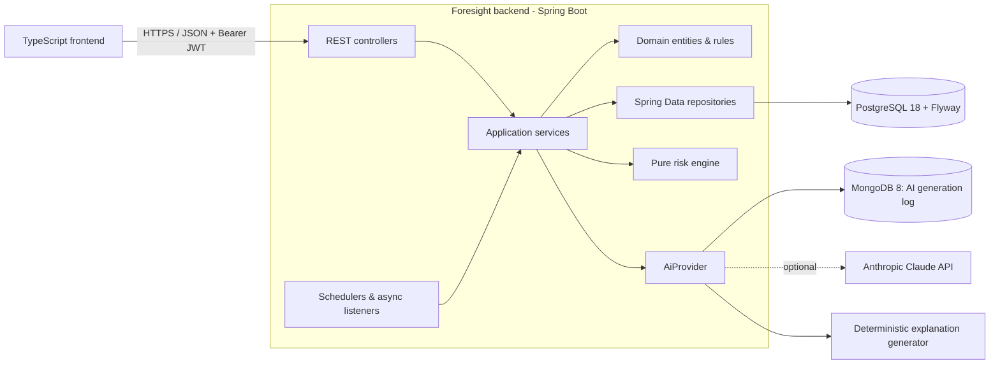
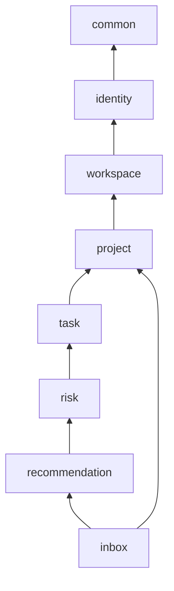
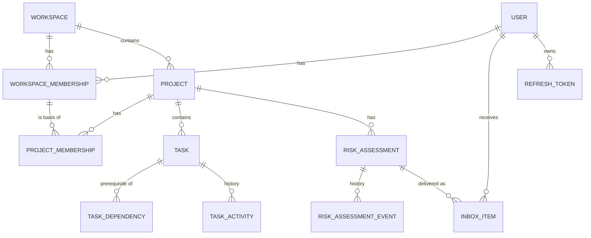

# Architecture

## 1. Overview

Foresight is a **modular monolith**: one Spring Boot 4.1 application (Java 25), packages organised by business capability. **PostgreSQL is the system of record** (all business data; locking, uniqueness and durable job state). **MongoDB** (added at the product owner's request) stores only the non-authoritative *AI generation log*. No message broker, cache or service mesh.

## 2. Modules

Root package `com.foresight`.

| Module | Responsibility | Key types |
|---|---|---|
| `common` | Cross-cutting: error model (RFC 7807), pagination, clock, JSON, OpenAPI, request-ID filter, async config, current-user access | `ApiExceptionHandler`, `PageResponse`, `DomainException` family, `CurrentUser` |
| `identity` | Users, registration, login, JWT issuing/validation, refresh tokens, security filter chain | `User`, `AuthService`, `TokenService`, `SecurityConfig` |
| `workspace` | Workspaces, workspace memberships and roles, last-owner invariant | `Workspace`, `WorkspaceMembership`, `WorkspaceService`, `WorkspaceAccess` |
| `project` | Projects, project memberships, **effective-permission resolution**, project data versioning, project events | `Project`, `ProjectMembership`, `ProjectService`, `ProjectAccessService`, `ProjectDataChangedEvent` |
| `task` | Tasks, lifecycle, dependencies (cycle-safe), activity history, read model for analysis | `Task`, `TaskStatus`, `TaskDependency`, `TaskActivity`, `TaskService`, `DependencyService`, `TaskQueryApi` |
| `risk` | Pure engine (`risk.engine`: snapshot, rules, scoring, graph), assessment persistence & lifecycle reconciliation, scheduling/triggers, risk API | `RiskEngine`, `RiskRule`, `ScoringPolicy`, `RiskAssessment`, `RiskAnalysisService`, `RiskReconciler` |
| `recommendation` | `AiProvider` abstraction, Anthropic provider, deterministic generator, output validation, explanation service, AI generation log (MongoDB) | `AiProvider`, `AnthropicAiProvider`, `DeterministicExplanationGenerator`, `ExplanationService`, `AiGenerationLog` |
| `inbox` | Recipient resolution, delivery pipeline (claim → explain → upsert), inbox queries and state changes | `InboxItem`, `RiskAlertDeliveryService`, `InboxService` |

Each module is split into sub-packages:

- `api` – controllers and request/response DTOs (records). Never exposes entities.
- `application` – transactional use-case services, commands, events, listeners.
- `domain` – JPA entities with behaviour/invariants, enums, Spring Data repository interfaces (repositories are module-internal).
- `infrastructure` – technical adapters (JWT, AI HTTP clients, schedulers) when the module has any.

### Dependency direction

Rules (enforced by ArchUnit tests in `ArchitectureTest`):

1. No cycles between modules.
2. `..api..` classes must not depend on `..domain..` repositories.
3. A module's Spring Data repositories are used only inside that module; other modules go through application-layer APIs (`UserDirectory`, `WorkspaceAccess`, `ProjectAccessService`, `ProjectQueryApi`, `ProjectWriteGuard`, `TaskQueryApi`, `RiskQueryService`, `RiskDeliveryStore`). Shared read-only types: domain enums and the `RiskAssessment` handed to `recommendation`/`inbox` through `ExplanationPort`/`RiskDeliveryStore`.
4. `risk.engine` depends only on the JDK (no Spring, no JPA) – it is a pure function `ProjectSnapshot → List<RiskSignal>`.
5. `risk` reaches `recommendation` only through the `ExplanationPort` interface it owns (dependency inversion).
6. Upstream modules communicate downstream through Spring application events (e.g. `project` → `inbox` for member removal, `task` → `risk` for re-analysis), never by calling downstream code.

## 3. Layering rules

- Controllers: HTTP mapping, `@Valid` request DTOs, resolve the current user from the JWT, delegate to one application service call, map results to response DTOs.
- Application services: transactions, authorization (`ProjectAccessService.require(...)`), orchestration, event publication.
- Domain entities: guard invariants (status transitions, progress range, date ordering) and throw `DomainException`s.
- Repositories: persistence only; paged/bounded queries.

## 4. Domain model (summary)

See `domain-model.md` for full rules.

## 5. Transaction boundaries

| Operation | Boundary |
|---|---|
| Any task/dependency/project-member mutation | One transaction. It first executes `UPDATE projects SET data_version = data_version + 1` (row lock) – this **serializes writes per project** and lets analysis detect staleness. |
| Add dependency | Same transaction: lock project row → load project graph → reachability check → insert. Concurrent opposite edges cannot both commit. |
| Workspace membership change | Lock workspace row (`SELECT … FOR UPDATE`) → check last-owner invariant → mutate. |
| Risk analysis | (1) read-only `REPEATABLE READ` transaction builds an immutable snapshot incl. `data_version`; (2) engine runs outside any transaction; (3) reconciliation transaction locks the project row, aborts if `data_version` changed (retry ≤ 3), then upserts assessments/events. |
| Alert delivery | (1) short transaction claims the assessment (`PENDING → IN_PROGRESS`, lease); (2) AI call **outside** any transaction; (3) short transaction locks the assessment, verifies revision unchanged, stores explanation, upserts inbox items, marks `DELIVERED`. |
| AI generation log | Separate, asynchronous, best-effort MongoDB insert (no shared transaction with PostgreSQL); a failure only loses the log entry. |

## 6. Authentication & authorization

- Stateless bearer JWT (HS256, 15 min) issued at login/registration/refresh; refresh tokens are random 256-bit values stored as SHA-256 hashes, rotated on every use; reuse of a rotated token revokes all of the user's refresh tokens.
- Spring Security resource-server validation (`JwtDecoder` with issuer, expiry, signature checks); `sub` = user ID.
- Authorization is **resource-based in application services** through `ProjectAccessService` / `WorkspaceAccess`; inbox items are filtered by `recipient_id = currentUser`.
- Details: `security.md`.

## 7. Background processing

| Job | Trigger | Default |
|---|---|---|
| Periodic analysis | `@Scheduled(fixedDelay)` over ACTIVE projects with unfinished tasks, paged | every 15 min (`APP_RISK_ANALYSIS_INTERVAL`) |
| Change-triggered analysis | `@TransactionalEventListener(AFTER_COMMIT)` on `ProjectDataChangedEvent`, coalesced per project with a short debounce (`TaskScheduler`) | 5 s debounce; `APP_RISK_ON_CHANGE_ENABLED` |
| Alert delivery | `@Async` after-commit listener for assessments marked `PENDING` (same on-change switch), plus sweeper | sweeper every 60 s (`APP_RISK_SCHEDULING_ENABLED`); lease 5 min; max 5 attempts |

Correctness never depends on in-memory state: the coalescing map is only an optimization; locks, `data_version` checks, and unique constraints make repeated or concurrent runs (also across instances) safe. See `ai-risk-engine.md` §9.

## 8. AI provider integration

`AiProvider` (in `recommendation`) receives an `ExplanationRequest` – a minimal structured summary of one assessment (facts, factors, affected tasks with titles/assignee names, missing data). Implementations:

- `DeterministicExplanationGenerator` – default and fallback; template-based, uses only evidence.
- `AnthropicAiProvider` – enabled with `APP_AI_PROVIDER=anthropic` + `ANTHROPIC_API_KEY`; uses the official `anthropic-java` SDK with typed structured output (`outputConfig(Class)`), model `claude-opus-5-5` by default, request timeout and bounded retries.

Output is validated (`ExplanationValidator`) and treated as untrusted text; on any failure (timeout, 4xx/5xx, rate limit, refusal, invalid JSON/schema) the deterministic generator is used and the source is recorded as `FALLBACK`. Every generation (provider, model, outcome, fallback reason, latency – never prompts or output text) is appended to the MongoDB collection `ai_generations` (90-day TTL) and exposed read-only at `GET /api/v1/risks/{id}/ai-generations`.

## 9. Error handling & observability

- Single `@RestControllerAdvice` produces `application/problem+json` with `code`, `title`, `status`, `detail`, `instance`, `timestamp`, optional `errors[]`. Unknown exceptions → 500 with a generic message (details only in logs, tagged with request ID).
- `RequestIdFilter` reads/creates `X-Request-Id`, puts it in MDC and the response.
- Actuator: `/actuator/health` (public; includes PostgreSQL and MongoDB), `/actuator/info`; Micrometer counters `foresight.risk.analyses`, `foresight.inbox.deliveries`, `foresight.inbox.delivery.failures`, `foresight.ai.explanations`, `foresight.ai.fallbacks`, `foresight.ai.generation_log.failures`.
- Secrets, passwords and tokens are never logged.

## 10. Key decisions & trade-offs

| Decision | Trade-off |
|---|---|
| Modular monolith with package boundaries + ArchUnit | Simple to run; boundaries are enforced by tests rather than the compiler. |
| Per-project write serialization via `data_version` row lock | Very simple correctness for graph invariants and stale-analysis detection; limits write concurrency within one project (fine for team-sized projects). |
| JSON stored as `text` columns, serialized by the application | Avoids coupling Hibernate's JSON mapping to Jackson 3; fields are not queried by content. |
| One assessment row per risk identity (`project_id, fingerprint` unique) | Natural dedupe and lifecycle; history kept in `risk_assessment_events`. |
| One inbox item per (assessment, recipient) | No spam; material changes update and resurface the same item. |
| Deterministic engine, LLM only for wording/recommendations | Testable, explainable; LLM cannot invent facts because facts are rendered from evidence. |
| Polling + after-commit triggers instead of a queue | No extra infrastructure; at-least-once delivery with idempotent writes. |
| Effective role: workspace ADMIN/OWNER ⇒ project LEAD | Avoids duplicating membership rows for admins. |
| MongoDB only for the AI generation log | Requested by the product owner. PostgreSQL stays the single source of truth for transactional data (no cross-store consistency problems); append-only telemetry with TTL expiry fits a document store. Cost: one more service to run, and `/actuator/health` reports DOWN when MongoDB is unreachable even though business operations continue. |
