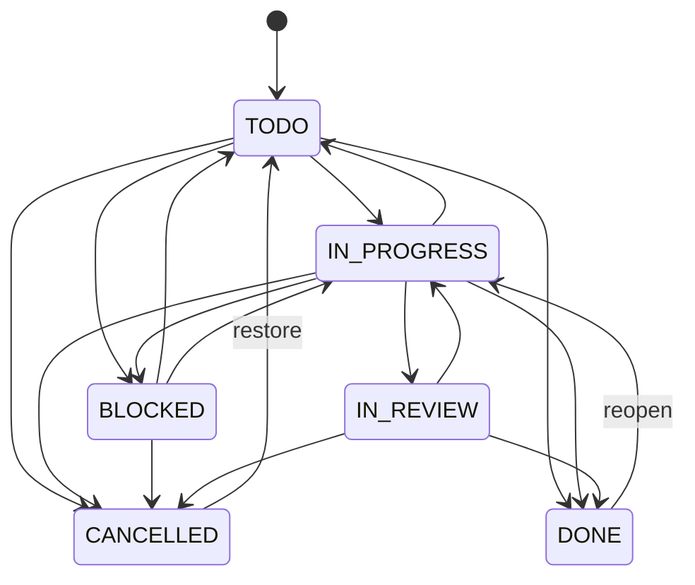

# Domain Model

All identifiers are UUIDs generated by the application. All timestamps are `Instant` (UTC, `timestamptz`); calendar dates (`startDate`, `dueDate`, `deadline`) are `LocalDate` interpreted in the configured business time zone (`APP_TIME_ZONE`, default `UTC`). "DB" in the tables below marks constraints enforced by PostgreSQL in addition to application checks.

## User

| Field | Req. | Rules |
|---|---|---|
| `id` | ✔ | |
| `fullName` | ✔ | 1–120 chars, trimmed |
| `email` | ✔ | valid e-mail ≤ 254, trimmed + lower-cased; **unique (DB)**, `email = lower(email)` (DB) |
| `passwordHash` | ✔ | BCrypt; plaintext never stored or logged |
| `enabled` | ✔ | disabled users cannot log in or refresh |
| `createdAt`, `updatedAt` | ✔ | |

Password policy: 8–128 characters, at least one letter and one digit.

## RefreshToken

`userId`, `tokenHash` (SHA-256 hex, **unique DB**), `expiresAt`, `createdAt`, `revokedAt?`, `replacedById?`. Lifecycle: `active → rotated (revokedAt + replacedBy)` or `revoked (logout/reuse)`; expired tokens are rejected.

## Workspace / WorkspaceMembership

- Workspace: `name` 1–120 chars.
- Membership: (`workspaceId`, `userId`) **unique (DB)**, `role ∈ {OWNER, ADMIN, MEMBER}` (DB check).
- Invariants: creator becomes `OWNER`; there is always ≥ 1 `OWNER` (checked under a workspace row lock); only an `OWNER` may grant/revoke `OWNER`; `ADMIN` may manage `ADMIN`/`MEMBER`; a member may remove themselves (leave) unless last owner.
- Removing a workspace member cascades (DB) to their project memberships; their unfinished tasks in that workspace become unassigned (activity recorded) and their inbox items for those projects are deleted.

## Project / ProjectMembership

| Field | Req. | Rules |
|---|---|---|
| `workspaceId` | ✔ | immutable |
| `name` | ✔ | 1–160 chars |
| `description` | | ≤ 5000 chars |
| `status` | ✔ | `ACTIVE`, `ON_HOLD`, `COMPLETED`, `ARCHIVED` (DB check) |
| `startDate`, `deadline` | | `deadline ≥ startDate` when both set (DB check) |
| `createdBy` | ✔ | |
| `version` | ✔ | optimistic lock for edits |
| `dataVersion` | ✔ | incremented by every write that affects risk inputs; used for write serialization and stale-analysis detection |
| `lastAnalyzedAt`, `lastAnalyzedDataVersion` | | set by analysis |

Status transitions: `ACTIVE ↔ ON_HOLD`, `ACTIVE/ON_HOLD → COMPLETED`, `COMPLETED → ACTIVE`, any → `ARCHIVED` (archive endpoint), `ARCHIVED → ACTIVE` (restore). Tasks of non-`ACTIVE`/`ON_HOLD` projects are read-only. Only `ACTIVE` projects are analysed; when a project leaves `ACTIVE`, its active assessments are resolved with reason `PROJECT_INACTIVE` at the next analysis.

ProjectMembership: (`projectId`, `userId`) **unique (DB)**; `role ∈ {LEAD, CONTRIBUTOR, VIEWER}`; composite FK to `workspace_memberships(workspace_id, user_id)` (DB) guarantees the user belongs to the project's workspace. Creator becomes `LEAD`. Project member operations keep ≥ 1 explicit `LEAD` (`409 LAST_LEAD`); removing a user from the *workspace* can leave a project without an explicit lead, in which case workspace OWNER/ADMINs (implicit leads) manage it and receive lead notifications. Removing a member unassigns their unfinished tasks in the project and deletes their inbox items for it.

Effective role: workspace `OWNER`/`ADMIN` → `LEAD`; else membership role; else none.

## Task

| Field | Req. | Rules |
|---|---|---|
| `projectId` | ✔ | immutable |
| `title` | ✔ | 1–200 chars |
| `description` | | ≤ 10000 chars |
| `status` | ✔ | see lifecycle |
| `priority` | ✔ | `LOW`, `MEDIUM` (default), `HIGH`, `CRITICAL` |
| `assigneeId` | | must have effective access ≥ CONTRIBUTOR (not VIEWER) in the project |
| `reporterId` | ✔ | creator |
| `startDate`, `dueDate` | | `dueDate ≥ startDate` (DB) |
| `estimatedHours`, `actualHours` | | 0 – 10000, two decimals (DB check ≥ 0) |
| `progressPercentage` | ✔ | 0–100 (DB); set to 100 on `DONE`; never auto-completes the task |
| `completedAt` | | set iff `status = DONE` (DB check) |
| `lastProgressAt` | | last time progress increased or the task advanced (`→ IN_PROGRESS`, `→ IN_REVIEW`, `→ DONE`); basis of the stall rule |
| `archivedAt` | | archived tasks are hidden from lists/analysis; their dependencies are removed |
| `version` | ✔ | optimistic lock; clients must send it with every mutation |

### Lifecycle

- Transitions into `IN_PROGRESS`, `IN_REVIEW`, `DONE` require all finish-to-start prerequisites to be **satisfied** (`DONE` or `CANCELLED`); otherwise `409 DEPENDENCY_NOT_SATISFIED`.
- `DONE` and `CANCELLED` are *closed*; closed tasks are never reported as overdue/stalled/approaching.
- A passed due date never changes status.

## TaskDependency

`projectId`, `predecessorTaskId` (prerequisite), `successorTaskId` (dependent), `type = FINISH_TO_START`, `createdBy`, `createdAt`.

- (`predecessor`, `successor`) **unique (DB)**; `predecessor ≠ successor` (DB); both tasks in the same project (composite FKs to `tasks(id, project_id)`, DB).
- No cycles: checked by graph reachability under the project row lock (`409 DEPENDENCY_CYCLE`, response lists the cycle path).
- Archived tasks cannot gain dependencies; archiving removes existing ones.

## TaskActivity

Append-only: `taskId`, `projectId`, `actorId?`, `type`, `oldValue?`, `newValue?` (≤ 500 chars), `occurredAt`.
Types: `CREATED`, `DETAILS_UPDATED`, `STATUS_CHANGED`, `ASSIGNEE_CHANGED`, `PRIORITY_CHANGED`, `DUE_DATE_CHANGED`, `ESTIMATE_CHANGED`, `PROGRESS_UPDATED`, `DEPENDENCY_ADDED`, `DEPENDENCY_REMOVED`, `ARCHIVED`, `UNASSIGNED_BY_MEMBERSHIP_CHANGE`.
The system does not reconstruct history it did not record: tasks created before a field was tracked have no synthetic entries.

## RiskAssessment

One row per **risk identity** = (`projectId`, `fingerprint`) **unique (DB)**, where fingerprint = `CATEGORY:subjectType:subjectId` (e.g. `OVERDUE_TASK:TASK:<uuid>`).

| Field | Notes |
|---|---|
| `category` | `OVERDUE_TASK`, `APPROACHING_DEADLINE`, `STALLED_TASK`, `BLOCKED_DEPENDENCY`, `PROJECT_DEADLINE`, `WORKLOAD_IMBALANCE` |
| `taskId?`, `subjectUserId?` | affected task / overloaded user |
| `status` | `ACTIVE`, `RESOLVED` |
| `severity` | `LOW`, `MEDIUM`, `HIGH`, `CRITICAL` (derived from score) |
| `score` | 0–100 heuristic (DB check) – **not a probability** |
| `confidence` | `LOW`, `MEDIUM`, `HIGH` |
| `title`, `summary` | deterministic text from evidence |
| `factorsJson`, `evidenceJson`, `affectedTaskIdsJson`, `missingDataJson` | structured explanation inputs |
| `contentHash` | hash of material content (severity, factors, evidence, affected tasks) |
| `revision` | increments on DETECTED / ESCALATED / REOPENED (the "alert-worthy" changes) |
| `firstDetectedAt`, `lastEvaluatedAt`, `lastChangedAt`, `resolvedAt?`, `resolutionReason?`, `reopenCount` | |
| `analyzedDataVersion` | project `dataVersion` the assessment reflects |
| `explanationJson?`, `explanationSource?`, `explanationRevision?` | stored explanation for the delivered revision |
| `deliveryStatus` | `NOT_REQUIRED`, `PENDING`, `IN_PROGRESS`, `DELIVERED`, `FAILED`; `deliveryAttempts`, `deliveryClaimedAt`, `nextDeliveryAttemptAt` |

Lifecycle events (`RiskAssessmentEvent`): `DETECTED`, `ESCALATED` (severity up), `MITIGATED` (severity down), `UPDATED` (content changed, same severity), `RESOLVED`, `REOPENED`. Unchanged evaluations only bump `lastEvaluatedAt`.
Resolution reasons: `CONDITION_CLEARED`, `TASK_CLOSED`, `TASK_ARCHIVED`, `PROJECT_INACTIVE`.

## InboxItem

One per (`assessmentId`, `recipientId`) **unique (DB)**.

| Field | Notes |
|---|---|
| `recipientId`, `projectId`, `taskId?`, `assessmentId` | navigation |
| `category`, `severity`, `title` | snapshot at delivery |
| `explanationJson` | summary, observed facts, inferences, consequences, assumptions, unknowns, confidence note |
| `actionsJson` | prioritized recommended actions |
| `assessmentRevision` | revision delivered |
| `readAt?` | read state |
| `disposition` | `OPEN`, `ACKNOWLEDGED`, `DISMISSED` (+ `dispositionAt`) |
| `createdAt`, `lastDeliveredAt`, `updatedAt` | |

Re-delivery of a newer revision (escalation or reopen) updates content, sets `readAt = null`, `disposition = OPEN`, `lastDeliveredAt = now`. Risk status is read live from the assessment (`riskStatus` in responses) – reading or dismissing an item never resolves the risk.
